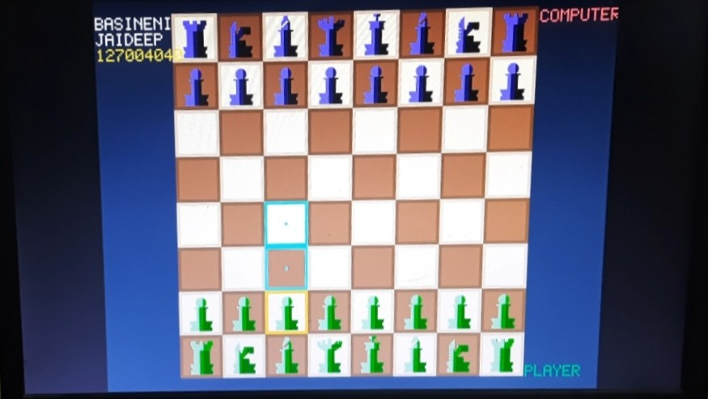
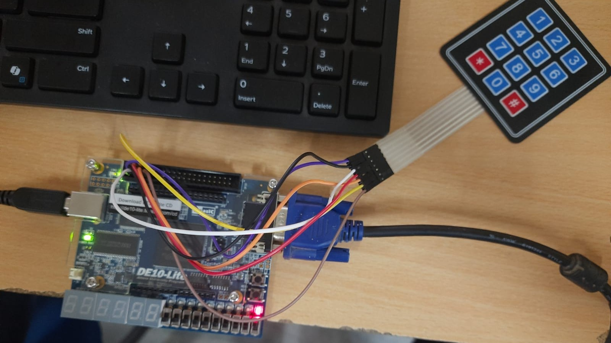

# FPGA Chess on Intel MAX10 DE10-Lite

Developed a fully functional chess game on an Intel MAX10 FPGA using SystemVerilog. The game runs on a VGA monitor at 640×480, accepts input via a matrix keypad, enforces all official chess rules in hardware, and renders the board and pieces procedurally at the pixel level all without a soft-core processor or external memory.

---

## Demo

| VGA Output (640×480 @ 60 Hz) | Hardware Setup |
|:---:|:---:|
|  |  |

---

## Features

- Full chess rules for all 6 piece types including path obstruction, pawn promotion, check and checkmate detection
- 640×480 @ 60 Hz VGA output with procedurally rendered 3D-shaded pieces, valid move highlights in cyan, blinking red check alerts and captured piece panels
- 4×3 matrix keypad input with hardware debounce and metastability synchronization
- Dual clock domain 25 MHz for VGA pixel rendering, 24.4 kHz for game logic, both derived from the 50 MHz onboard crystal
- Computer opponent that plays as Black, evaluating moves using piece values, positional scoring, fork detection and blunder avoidance
- 4,096 parallel combinational move validators instantiated simultaneously for real-time checkmate detection

---

## System Architecture

Seven hardware modules instantiated in `chess_top.sv`:

| Module | Clock | Function |
|--------|-------|----------|
| `clk_divider.sv` | 50 MHz in | Counter-based clock divider → 25 MHz + 24.4 kHz |
| `vga_sync.sv` | 25 MHz | 640×480 @ 60 Hz HSYNC/VSYNC timing generator |
| `keypad_scanner.sv` | 24.4 kHz | 4×3 matrix scan with 2-stage sync and release-timer debounce |
| `move_validator.sv` | Combinational | Legality checker for all 6 piece types with path obstruction |
| `game_logic.sv` | 24.4 kHz | 6-state FSM managing board registers, turns, check and checkmate |
| `chess_bot.sv` | 24.4 kHz | Computer opponent with positional scoring and threat analysis |
| `display_engine.sv` | 25 MHz | Per-pixel colour engine for board, pieces, text and UI overlays |

---

## Hardware Requirements

| Item | Details |
|------|---------|
| FPGA Board | Intel DE10-Lite (MAX10 10M50DAF484C7G) |
| Input | 4×3 matrix keypad connected to GPIO_1[0:6] |
| Output | VGA monitor via DE-15 connector |
| Programming | USB-Blaster via micro-USB |
| EDA Tool | Intel Quartus Prime Lite Edition |
| HDL | SystemVerilog (IEEE 1800-2005) |

---

## Keypad Controls

| Key | Action |
|-----|--------|
| `2` | Cursor Up |
| `8` | Cursor Down |
| `4` | Cursor Left |
| `6` | Cursor Right |
| `5` | Select piece / Confirm move |
| `0` | Cancel / Deselect |

---

## How to Run

**1. Open Quartus Prime Lite**
- File → New Project Wizard
- Project name: `chess_fpga`, Top-level entity: `chess_top`
- Device: MAX 10 → `10M50DAF484C7G`

**2. Add source files**
- Project → Add/Remove Files in Project
- Add all `.sv` files from `src/`

**3. Import pin assignments**
- Assignments → Import Assignments → select `pin_assignments/chess_top.qsf`

**4. Set HDL version**
- Assignments → Settings → Compiler Settings → SystemVerilog 2005

**5. Compile**
- Processing → Start Compilation (Ctrl+L)
- Takes around 90 minutes on first run

**6. Program the board**
- Tools → Programmer → Auto Detect → Add File (`output_files/chess_top.sof`) → Start
- Connect VGA cable and keypad to GPIO_1
- Press KEY[0] to reset — chess board appears on monitor

---

## Known Limitations / Future Work

- [ ] Castling
- [ ] En passant
- [ ] Stalemate detection
- [ ] Permanent flash programming for power-on autostart
- [ ] HDMI output for higher resolution

---

## License

MIT License
